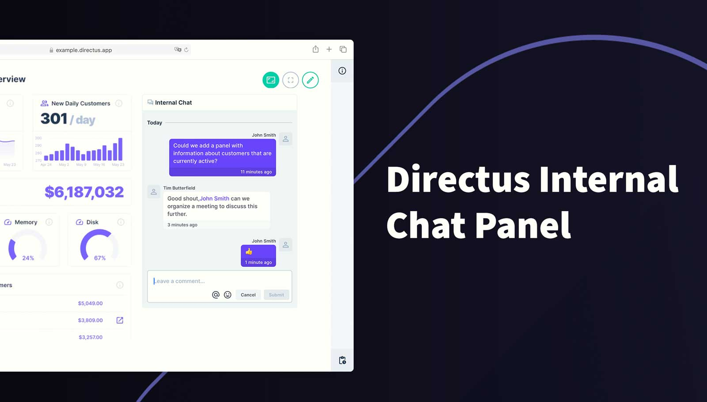
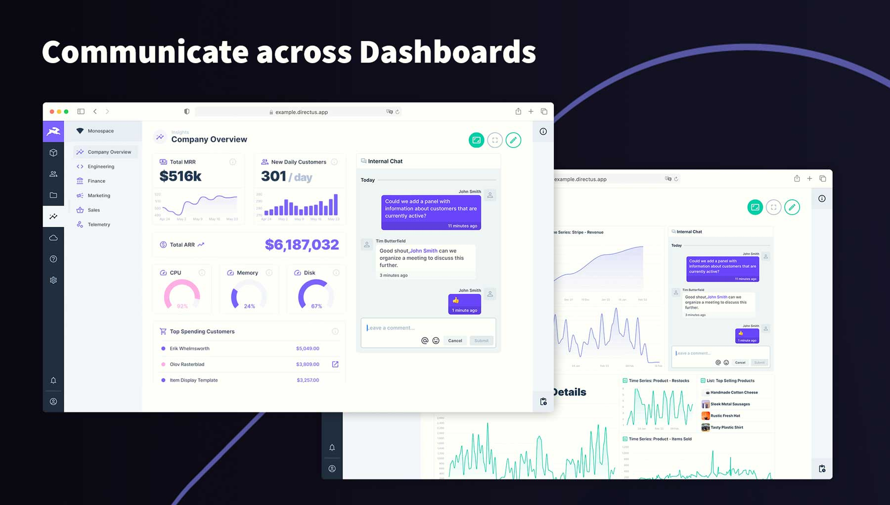
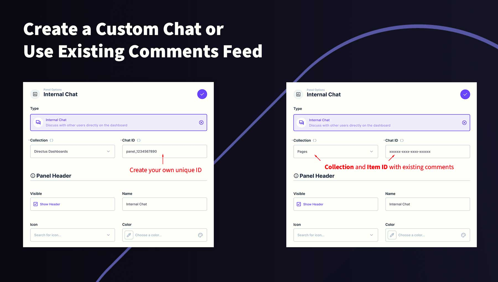
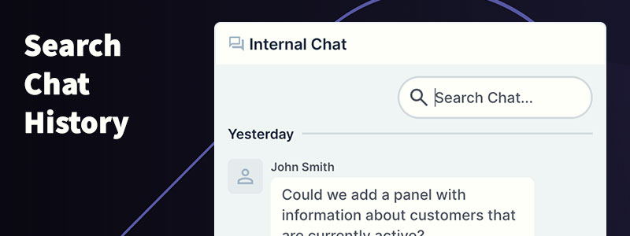
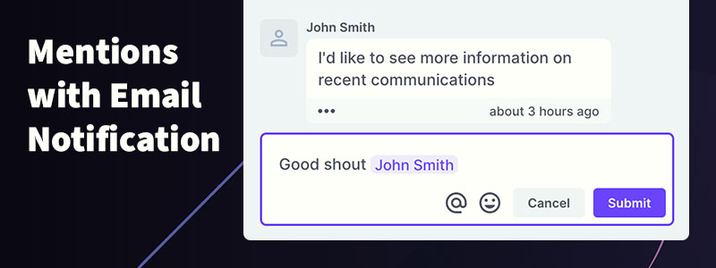
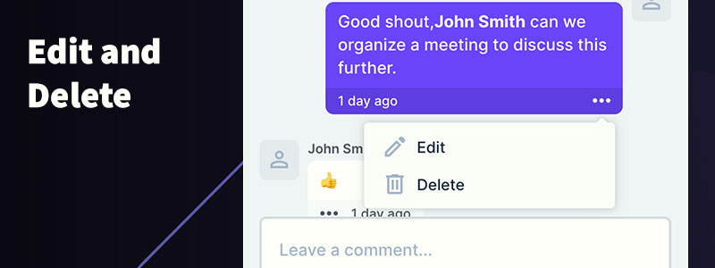
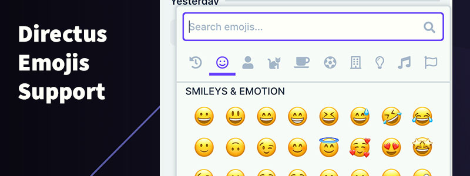

# Directus Internal Chat Panel

Native internal chat panel for communicating with other users from a dashboard.

## Details

- This extension will solve internal communication issues by providing a customized chat that can be linked to a collection and be made persistant across dashboards
- Uses the built-in comments feature in the activity table. Simply choose the collection and quote an item id or type a unique identifyer for the chat.
- Given more time, I would improve the chat search and look at making the chat closer to realtime.

## Requirements

- Directus 10.0.0+

## How to add this Panel to a Dashboard

1. Add this extension into the project's extensions/operations folder
2. Start/Restart Directus
3. Create a new Panel and select **Internal Chat** from the list
4. Choose a collection from the list or leave it on the default option
5. Set a unique ID for this chat. You can reuse this ID if you want a persistant chat across your other dashboards
6. (Optional) Use the header to create a name for this chat
7. Save the panel and position/resize as required
8. Save the dashboard

## How to use this Panel

The chat is available as soon as you open the dashboard.

### Write a comment

Use the input field at the bottom to type a response and click submit

### Catch up on the conversation

By default, the panel will load on the latest comment. If you need to catch up, simple scroll back through the comments which are grouped by day.

### Search the chat

Yes, you can search the chat! Simply type your search term into the search field at the top of the panel. Currently this is limited to the following fields:

- The contents of the comment
- First name of the user
- Last name of the user
- Email address of the user

### Emojis

There is an emoji selection button for inserting your choice of emojis from the built-in Directus component. This will place the emoji at the location of the cursor.

### Mentions

You can mention other users by typing @ or click the mention button at the bottom, then select a user from the list. If you start typing their name, the list will filter to mathcing results. You must click the user from the list to insert them into the chat.

Mentions will notify that user by email and include your message in the email. This is a great way to invite others to join the conversionation.

### Edit/Delete a comment

Owners of a comment and Administrators can edit or delete comments using the ellipsis next to the time. When editing the comment, the contents of the comment are loaded into the input field at the bottom. Simply make the change and click **Save**.

When deleting a comment, a confirmation dialog will appear for confirmation.

## Permissions

To use this chat, your users will need the following permissions
- Read permissions for the selected collection
- Read permissions to the Directus activity feed to see chat items
- Write permissions to the Directus activity feed for posting to the chat

### Granular Permissions

You can use the custom permissions feature to filter out comments in the activity feed where required. For example, you could hide comments made from a moderator user/role, or only show comments from other users in the same role so each department gets their own feed.

## Screenshots

